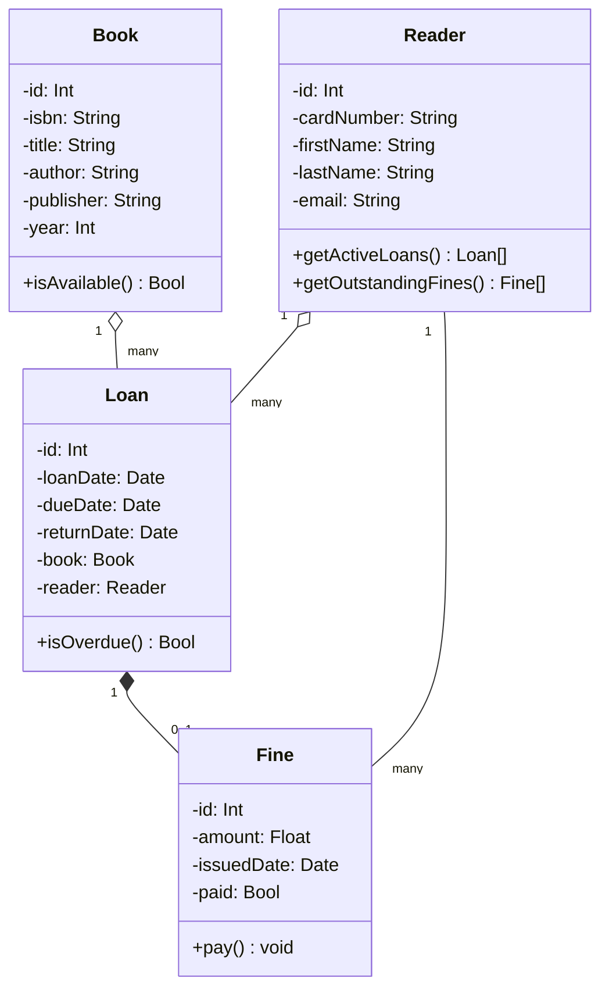

```mermaid
classDiagram
    class Book {
        -id: Int
        -isbn: String
        -title: String
        -author: String
        -publisher: String
        -year: Int
        +isAvailable() Bool
    }

    class Reader {
        -id: Int
        -cardNumber: String
        -firstName: String
        -lastName: String
        -email: String
        +getActiveLoans() Loan[]
        +getOutstandingFines() Fine[]
    }

    class Loan {
        -id: Int
        -loanDate: Date
        -dueDate: Date
        -returnDate: Date
        -book: Book
        -reader: Reader
        +isOverdue() Bool
    }

    class Fine {
        -id: Int
        -amount: Float
        -issuedDate: Date
        -paid: Bool
        +pay() void
    }

    Book   "1"  o-- "many" Loan
    Reader "1"  o-- "many" Loan
    Reader "1"  -- "many" Fine
    Loan   "1"  *-- "0..1" Fine
```